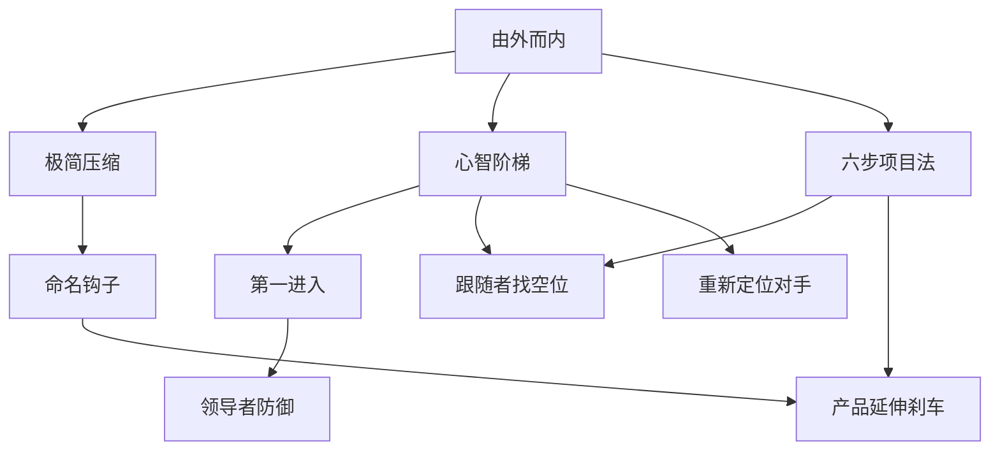

# INDEX — 《定位》Skill 地图

## 1. 技能总览

| # | Skill | 中文名 | 触发场景 |
|---:|---|---|---|
| 1 | `outside-in-position-diagnosis` | 由外而内定位诊断 | 当你在做品牌、产品、公司、个人或服务定位时，用预期客户头脑里的已有认知，而不是产品自我描述，来判断应该占据什么位置。 |
| 2 | `simple-message-compression` | 极简信息压缩 | 当市场噪音很大、卖点太多、受众记不住时，把传播信息压缩成一个能钻进大脑的小钩子。 |
| 3 | `first-in-mind-category-entry` | 第一心智进入法 | 当你要推出新品牌、新产品或新业务时，判断能否成为某个心智类别里的第一；如果不能，就重新划分更小的类别。 |
| 4 | `mental-ladder-mapping` | 心智阶梯映射 | 当你需要判断品牌在客户脑中排第几、该借谁的势、该避开什么对手时，用“品类阶梯”画出竞争位置。 |
| 5 | `leader-defense-positioning` | 领导者防御定位 | 当品牌已经是某个品类领导者时，用强化原始心智、拦截新概念和多品牌防御来保护位置，而不是自夸“我们第一”。 |
| 6 | `follower-gap-positioning` | 跟随者找空位法 | 当你不是领导者、也无法正面打赢时，用尺寸、价格、性别、年龄、时段、渠道、使用量等维度寻找尚未被占据的心智空位。 |
| 7 | `reposition-competitor` | 竞争对手重新定位 | 当市场没有明显空位时，通过动摇客户对竞争对手的旧认知，制造一个能让新品牌进入的空白。 |
| 8 | `naming-hook-design` | 命名钩子设计 | 当你要给品牌、产品、功能、项目或服务命名时，让名字成为挂上心智阶梯的钩子，而不是内部代号。 |
| 9 | `product-extension-kill-switch` | 产品延伸刹车器 | 当团队想把成功品牌名延伸到新品类、新型号或新业务时，用心智稀释风险判断该不该刹车。 |
| 10 | `six-step-positioning-project` | 六步定位项目法 | 当你要系统推进一个定位项目时，用六个问题把调研、目标位置、竞争、预算、坚持和表达一致性串起来。 |

## 2. 推荐调用顺序

- **从零开始做定位**：`six-step-positioning-project` → `outside-in-position-diagnosis` → `mental-ladder-mapping` → 按情况调用 `first-in-mind-category-entry` / `follower-gap-positioning` / `reposition-competitor`。
- **做传播文案/官网首屏/展会主题**：`outside-in-position-diagnosis` → `simple-message-compression` → `naming-hook-design`。
- **评估新品是否沿用老品牌名**：`product-extension-kill-switch` → `naming-hook-design` → `leader-defense-positioning`。
- **弱势品牌找突破口**：`mental-ladder-mapping` → `follower-gap-positioning` → `simple-message-compression`。

## 3. 引用关系图

## 4. 三重验证摘要

| Skill | V1 跨段佐证 | V2 预测力 | V3 非常识性 | 结论 |
|---|---|---|---|---|
| `outside-in-position-diagnosis` | 通过：PDF p.8 定位定义; PDF p.10 传播过度与既有认知 | 可用于新品牌/新场景判断 | 不是单纯‘做好营销’，有明确心智机制 | 保留 |
| `simple-message-compression` | 通过：PDF p.10 传播过度社会; PDF p.11 极其简化的信息 | 可用于新品牌/新场景判断 | 不是单纯‘做好营销’，有明确心智机制 | 保留 |
| `first-in-mind-category-entry` | 通过：PDF p.17 进军大脑的捷径; PDF p.18 第二进入的困难 | 可用于新品牌/新场景判断 | 不是单纯‘做好营销’，有明确心智机制 | 保留 |
| `mental-ladder-mapping` | 通过：PDF p.22-23 脑中小阶梯; PDF p.24 艾维斯第二定位 | 可用于新品牌/新场景判断 | 不是单纯‘做好营销’，有明确心智机制 | 保留 |
| `leader-defense-positioning` | 通过：PDF p.29-34 领导者的定位; PDF p.31 真东西与不露声色 | 可用于新品牌/新场景判断 | 不是单纯‘做好营销’，有明确心智机制 | 保留 |
| `follower-gap-positioning` | 通过：PDF p.35-40 跟随者的定位; PDF p.36 尺寸与高价空子 | 可用于新品牌/新场景判断 | 不是单纯‘做好营销’，有明确心智机制 | 保留 |
| `reposition-competitor` | 通过：PDF p.41-45 给竞争对手重新定位; PDF p.41 阿司匹林与泰诺 | 可用于新品牌/新场景判断 | 不是单纯‘做好营销’，有明确心智机制 | 保留 |
| `naming-hook-design` | 通过：PDF p.46-54 名字的威力; PDF p.54-56 无名陷阱 | 可用于新品牌/新场景判断 | 不是单纯‘做好营销’，有明确心智机制 | 保留 |
| `product-extension-kill-switch` | 通过：PDF p.63-78 产品延伸陷阱与适用条件; PDF p.72 短期优势与长期不利 | 可用于新品牌/新场景判断 | 不是单纯‘做好营销’，有明确心智机制 | 保留 |
| `six-step-positioning-project` | 通过：PDF p.106-109 通往成功的六个步骤; PDF p.108 坚持定位 | 可用于新品牌/新场景判断 | 不是单纯‘做好营销’，有明确心智机制 | 保留 |
